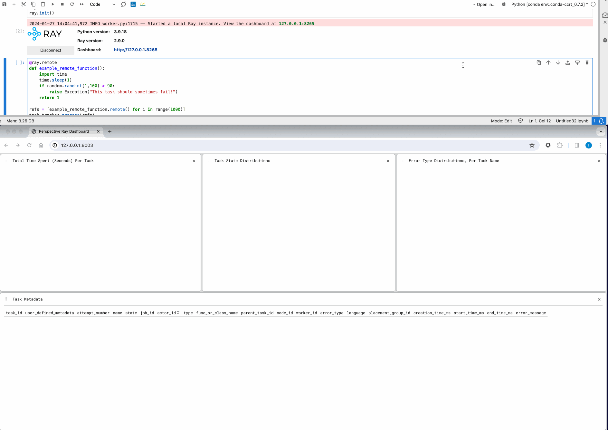
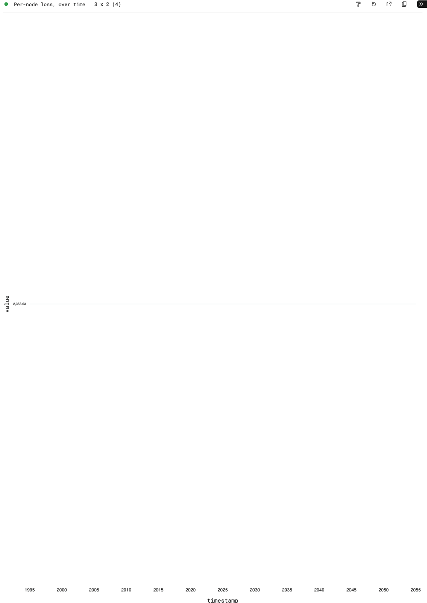

<!--
<a href="https://github.com/point72/raydar">
  </a>
</a>
<br/>
<br/>
-->

# raydar

A [perspective](https://perspective.finos.org/) powered, user editable ray dashboard via ray serve.

[](https://pypi.python.org/pypi/raydar)
[](https://github.com/Point72/raydar/LICENSE)
[](https://github.com/Point72/raydar/actions/workflows/build.yml)
[](https://github.com/Point72/raydar/blob/main/pyproject.toml)

<br/>


## Features

The `raydar` module provides an actor which can process collections of ray object references on your behalf, and can serve a [perspective](https://github.com/finos/perspective) dashboard in which to visualize that data.

```python
from raydar import RayTaskTracker
task_tracker = RayTaskTracker()
```

Passing collections of object references to this actor's `process` method causes those references to be tracked in an internal polars dataframe, as they finish running.

```python
@ray.remote
def example_remote_function():
    import time
    import random
    time.sleep(1)
    if random.randint(1,100) > 90:
        raise Exception("This task should sometimes fail!")
    return True

refs = [example_remote_function.remote() for _ in range(100)]
task_tracker.process(refs)
```

This internal dataframe can be accessed via the `.get_df()` method.

```raw
┌────────────────────────┬────────────────────────┬────────────────┬────────────────────────┬───┬───────────────────┬───────────────────┬───────────────────────┬───────────────┐

│ task_id                ┆ user_defined_metadata  ┆ attempt_number ┆ name                   ┆ … ┆ start_time_ms     ┆ end_time_ms       ┆ task_log_info         ┆ error_message │

│ ---                    ┆ ---                    ┆ ---            ┆ ---                    ┆   ┆ ---               ┆ ---               ┆ ---                   ┆ ---           │

│ str                    ┆ f32                    ┆ i64            ┆ str                    ┆   ┆ datetime[ms,      ┆ datetime[ms,      ┆ struct[6]             ┆ str           │

│                        ┆                        ┆                ┆                        ┆   ┆ America/New_York] ┆ America/New_York] ┆                       ┆               │

╞════════════════════════╪════════════════════════╪════════════════╪════════════════════════╪═══╪═══════════════════╪═══════════════════╪═══════════════════════╪═══════════════╡

│ 16310a0f0a45af5cffffff ┆ null                   ┆ 0              ┆ example_remote_functio ┆ … ┆ 2024-01-29        ┆ 2024-01-29        ┆ {"/tmp/ray/session_20 ┆ null          │

│ ffffffffff…            ┆                        ┆                ┆ n                      ┆   ┆ 07:17:09.340 EST  ┆ 07:17:12.115 EST  ┆ 24-01-29_07…          ┆               │

│ c2668a65bda616c1ffffff ┆ null                   ┆ 0              ┆ example_remote_functio ┆ … ┆ 2024-01-29        ┆ 2024-01-29        ┆ {"/tmp/ray/session_20 ┆ null          │

│ ffffffffff…            ┆                        ┆                ┆ n                      ┆   ┆ 07:17:09.341 EST  ┆ 07:17:12.107 EST  ┆ 24-01-29_07…          ┆               │

│ 32d950ec0ccf9d2affffff ┆ null                   ┆ 0              ┆ example_remote_functio ┆ … ┆ 2024-01-29        ┆ 2024-01-29        ┆ {"/tmp/ray/session_20 ┆ null          │

│ ffffffffff…            ┆                        ┆                ┆ n                      ┆   ┆ 07:17:09.342 EST  ┆ 07:17:12.115 EST  ┆ 24-01-29_07…          ┆               │

│ e0dc174c83599034ffffff ┆ null                   ┆ 0              ┆ example_remote_functio ┆ … ┆ 2024-01-29        ┆ 2024-01-29        ┆ {"/tmp/ray/session_20 ┆ null          │

│ ffffffffff…            ┆                        ┆                ┆ n                      ┆   ┆ 07:17:09.343 EST  ┆ 07:17:12.115 EST  ┆ 24-01-29_07…          ┆               │

│ f4402ec78d3a2607ffffff ┆ null                   ┆ 0              ┆ example_remote_functio ┆ … ┆ 2024-01-29        ┆ 2024-01-29        ┆ {"/tmp/ray/session_20 ┆ null          │

│ ffffffffff…            ┆                        ┆                ┆ n                      ┆   ┆ 07:17:09.343 EST  ┆ 07:17:12.115 EST  ┆ 24-01-29_07…          ┆               │

└────────────────────────┴────────────────────────┴────────────────┴────────────────────────┴───┴───────────────────┴───────────────────┴───────────────────────┴───────────────┘
```

Additionally, setting the `enable_perspective_dashboard` flag to `True` in the `RayTaskTracker`'s construction serves a perspective dashboard with live views of your completed references.

```python
task_tracker = RayTaskTracker(enable_perspective_dashboard=True)
```


## Create/Store Custom Views
From the developer console, save your workspace layout locally.

```javascript
let workspace = document.getElementById('perspective-workspace');

// Save the current layout
workspace.save().then(config => {
    // Convert the configuration object to a JSON string
    let json = JSON.stringify(config);

    // Create a Blob object from the JSON string
    let blob = new Blob([json], {type: "application/json"});

    // Create a download link
    let link = document.createElement('a');
    link.href = URL.createObjectURL(blob);
    link.download = 'workspace.json';

    // Append the link to the document body and click it to start the download
    document.body.appendChild(link);
    link.click();
    document.body.removeChild(link);
});
```

Then, move this json file to `js/src/layouts/default.json`.



## Expose Ray GCS Information
The data available to you includes much of what Ray's GCS tracks, and also allows for user defined metadata per task.

Specifically, tracked fields include:
 * `task_id`
 * `user_defined_metadata`
 * `attempt_number`
 * `name`
 * `state`
 * `job_id`
 * `actor_id`
 * `type`
 * `func_or_class_name`
 * `parent_task_id`
 * `node_id`
 * `worker_id`
 * `error_type`
 * `language`
 * `required_resources`
 * `runtime_env_info`
 * `placement_group_id`
 * `events`
 * `profiling_data`
 * `creation_time_ms`
 * `start_time_ms`
 * `end_time_ms`
 * `task_log_info`
 * `error_message`


## Custom Sources / Update Logic

The proxy server helpd by the `RayTaskTracker` is exposed via the `.proxy_server()` property, meaning we can create new tables as follows:


```python
task_tracker = RayTaskTracker(enable_perspective_dashboard=True)
proxy_server = task_tracker.proxy_server()
proxy_server.remote(
    "new",
    "metrics_table",
    {
        "node_id": "str",
        "metric_name": "str",
        "value": "float",
        "timestamp": "datetime",
    },
)
```

### Example: Live Per-Node Training Loss Metrics

If a user were to then update this table with data coming from, for example, a pytorch model training loop with metrics:

```python
def my_model_training_loop()

	for epoch in range(num_epochs):
        # ... my training code here ...

		data = dict(
			node_id=ray.get_runtime_context().get_node_id(),
			metric_name="loss",
			value=loss.item(),
			timestamp=time.time(),
		)
		proxy_server.remote("update", "metrics_table", [data])
```

Then they can expose a live view at per-node loss metrics across our model training process:



## Installation
`raydar` can be installed via [pip](https://pip.pypa.io) or [conda](https://docs.conda.io/en/latest/), the two primary package managers for the Python ecosystem.

To install `raydar` via **pip**, run this command in your terminal:

```bash
pip install raydar
```

To install `raydar` via **conda**, run this command in your terminal:

```bash
conda install raydar -c conda-forge
```

## License
This software is licensed under the Apache 2.0 license. See the [LICENSE](LICENSE) file for details.

