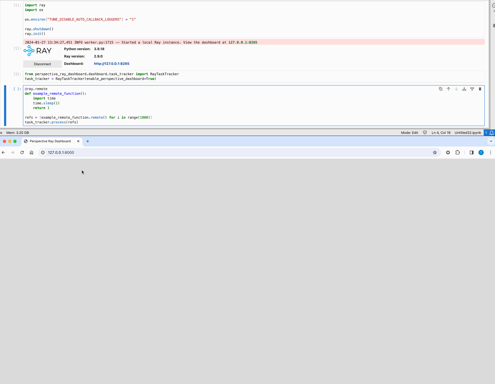
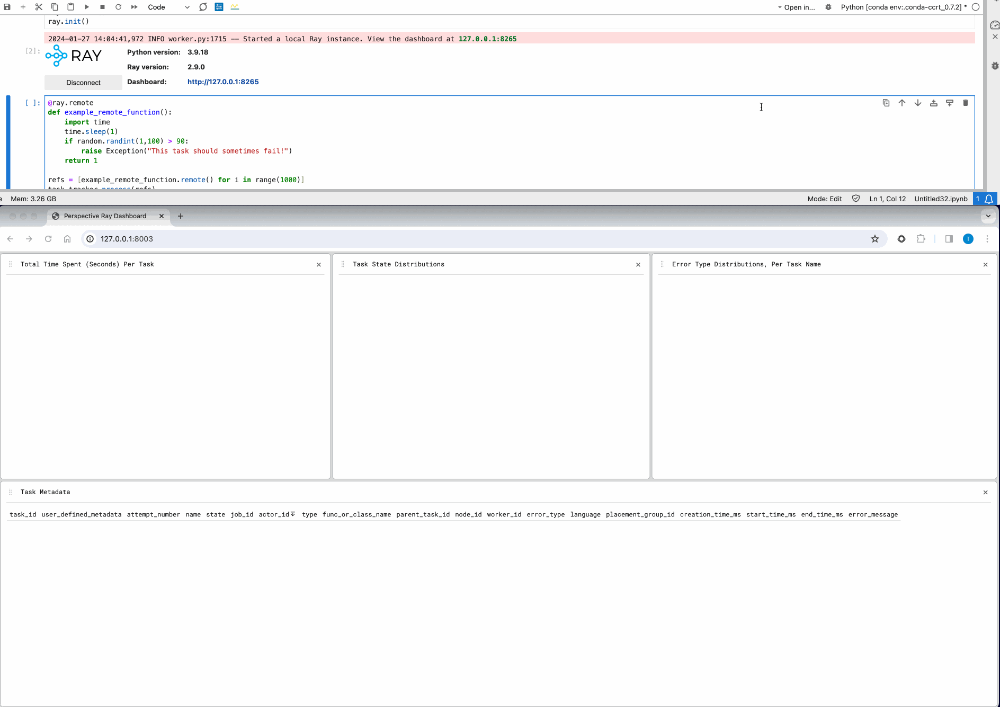
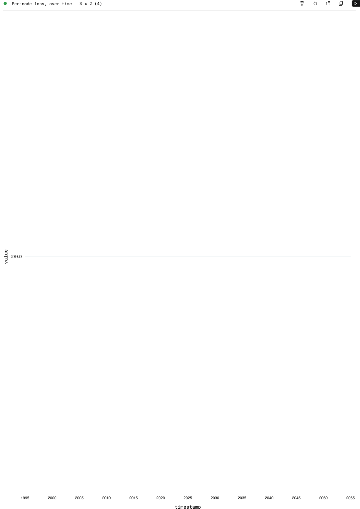

## Task Tracker

The `raydar` module provides an actor which can process collections of ray object references on your behalf, and can serve a [perspective](https://github.com/finos/perspective) dashboard in which to visualize that data.

```python
from raydar import RayTaskTracker
task_tracker = RayTaskTracker()
```

Passing collections of object references to this actor's `process` method causes those references to be tracked in an internal polars dataframe, as they finish running.

```python
@ray.remote
def example_remote_function():
    import time
    import random
    time.sleep(1)
    if random.randint(1,100) > 90:
        raise Exception("This task should sometimes fail!")
    return True

refs = [example_remote_function.remote() for _ in range(100)]
task_tracker.process(refs)
```

This internal dataframe can be accessed via the `.get_df()` method.

| task_id       | user_defined_metadata | attempt_number | name                      | ... | start_time_ms                   | end_time_ms                     | task_log_info                         | error_message |
| :------------ | :-------------------- | :------------- | :------------------------ | :-- | :------------------------------ | :------------------------------ | :------------------------------------ | :------------ |
| `str`         | `f32`                 | `i64`          | `str`                     |     | `datetime[ms,America/New_York]` | `datetime[ms,America/New_York]` | `struct[6]`                           | `str`         |
|               |                       |                |                           |     |                                 |                                 |                                       |               |
| 16310a0f0a... | `null`                | 0              | `example_remote_function` | ... | 2024-01-29 07:17:09.340 EST     | 2024-01-29 07:17:12.115 EST     | `{"/tmp/ray/session_2024-01-29_07...` | `null`        |
| c2668a65bd... | `null`                | 0              | `example_remote_function` | ... | 2024-01-29 07:17:09.341 EST     | 2024-01-29 07:17:12.107 EST     | `{"/tmp/ray/session_2024-01-29_07...` | `null`        |
| 32d950ec0c... | `null`                | 0              | `example_remote_function` | ... | 2024-01-29 07:17:09.342 EST     | 2024-01-29 07:17:12.115 EST     | `{"/tmp/ray/session_2024-01-29_07...` | `null`        |
| e0dc174c83... | `null`                | 0              | `example_remote_function` | ... | 2024-01-29 07:17:09.343 EST     | 2024-01-29 07:17:12.115 EST     | `{"/tmp/ray/session_2024-01-29_07...` | `null`        |
| f4402ec78d... | `null`                | 0              | `example_remote_function` | ... | 2024-01-29 07:17:09.343 EST     | 2024-01-29 07:17:12.115 EST     | `{"/tmp/ray/session_2024-01-29_07...` | `null`        |

Additionally, setting the `enable_perspective_dashboard` flag to `True` in the `RayTaskTracker`'s construction serves a perspective dashboard with live views of your completed references.

```python
task_tracker = RayTaskTracker(enable_perspective_dashboard=True)
```



## Create/Store Custom Views

From the developer console, save your workspace layout locally.

```javascript
let workspace = document.getElementById("perspective-workspace");

// Save the current layout
workspace.save().then((config) => {
  // Convert the configuration object to a JSON string
  let json = JSON.stringify(config);

  // Create a Blob object from the JSON string
  let blob = new Blob([json], { type: "application/json" });

  // Create a download link
  let link = document.createElement("a");
  link.href = URL.createObjectURL(blob);
  link.download = "workspace.json";

  // Append the link to the document body and click it to start the download
  document.body.appendChild(link);
  link.click();
  document.body.removeChild(link);
});
```

Then, move this json file to `js/src/layouts/default.json`.



## Expose Ray GCS Information

The data available to you includes much of what Ray's GCS tracks, and also allows for user defined metadata per task.

Specifically, tracked fields include:

- `task_id`
- `user_defined_metadata`
- `attempt_number`
- `name`
- `state`
- `job_id`
- `actor_id`
- `type`
- `func_or_class_name`
- `parent_task_id`
- `node_id`
- `worker_id`
- `error_type`
- `language`
- `required_resources`
- `runtime_env_info`
- `placement_group_id`
- `events`
- `profiling_data`
- `creation_time_ms`
- `start_time_ms`
- `end_time_ms`
- `task_log_info`
- `error_message`


## Custom Sources / Update Logic

The proxy server helpd by the `RayTaskTracker` is exposed via the `.proxy_server()` property, meaning we can create new tables as follows:

```python
task_tracker = RayTaskTracker(enable_perspective_dashboard=True)
proxy_server = task_tracker.proxy_server()
proxy_server.remote(
    "new",
    "metrics_table",
    {
        "node_id": "str",
        "metric_name": "str",
        "value": "float",
        "timestamp": "datetime",
    },
)
```

### Example: Live Per-Node Training Loss Metrics

If a user were to then update this table with data coming from, for example, a pytorch model training loop with metrics:

```python
def my_model_training_loop()

	for epoch in range(num_epochs):
        # ... my training code here ...

		data = dict(
			node_id=ray.get_runtime_context().get_node_id(),
			metric_name="loss",
			value=loss.item(),
			timestamp=time.time(),
		)
		proxy_server.remote("update", "metrics_table", [data])
```

Then they can expose a live view at per-node loss metrics across our model training process:


